# 自适应均衡器

_无13 孙文辉 2021012685_

## 画出$\{s(i),u(i),\hat{s}({i-\Delta})\}$的散点图

采用$\varepsilon-NLMS$算法训练均衡器

$\varepsilon-NLMS$由$LMS$算法改进而来，采用梯度下降法来进行”自适应均衡“过程

```matlab
function [Equalization]=equalization_train(Length,channel,SNR,Delta,N,step,epsilon,mode)
    %QPSK simulation
    sequence=randi([0,3],[Length+4*N,1]); %生成随机序列
    sequence_QPSK=qammod(sequence,4,'gray'); %QPSK调制
    QPSK_channel=filter(channel,1,sequence_QPSK); %信道传输
    %加入高斯白噪声
    power=2*(sum(channel.^2)); %信号功率
    y_QPSK=awgn(QPSK_channel,SNR,10*log10(power)); %加入高斯白噪声
    %均衡器训练
    Equalization=complex(zeros(1,2*N+1)); %均衡器初始化
    for i=1:Length
        sequence_train=y_QPSK(i+2*N:-1:i); %训练序列;
        err=sequence_QPSK(i+2*N-Delta)-Equalization*sequence_train; %误差
        %权值更新
        if mode==1 %LMS
            Equalization=Equalization+(step*conj(err).*sequence_train)';
        elseif mode==2 %NLMS
            Equalization=Equalization+(step*conj(err).*sequence_train./(epsilon+sequence_train'*sequence_train))';
        end
          
    end
end
```

设置为`16-QAM`，`NLMS`得到结果如下：

`s(i)`

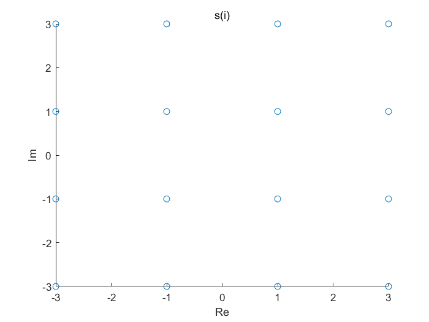

`u(i)`

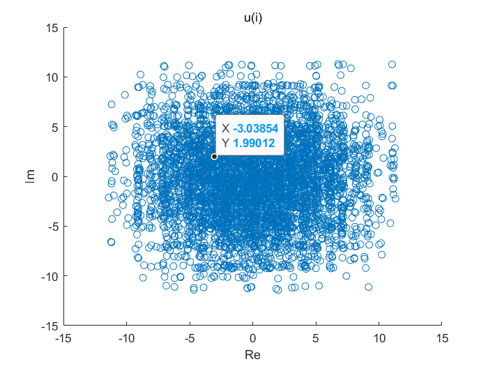

均衡后结果

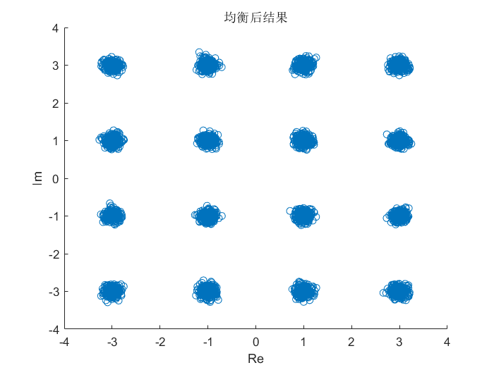


此时`SER=0`，在均衡前后，可以看出码间串扰的影响，均衡极大地消除了码间串扰。

## 增大迭代次数

### 仅改变迭代次数

#### 迭代次数=150

输出均衡器散点图如下：

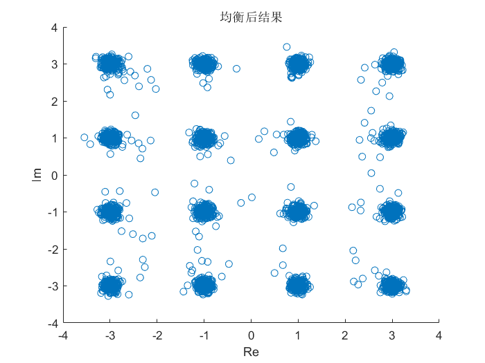

`SER=0.0008`

#### 迭代次数=300

输出均衡器散点图如下：

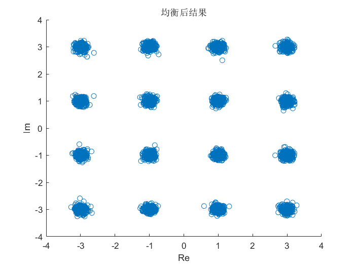

`SER=0`，此时自适应算法已经拟合完成

#### 迭代次数=500

输出均衡器散点图如下：


`SER=0`，此时自适应算法已经拟合完成，继续增大迭代次数只会导致通信效率的下降。

### 改变迭代次数与步长并采用LMS

#### 步长=0.001，迭代次数=150

输出均衡器散点图如下：

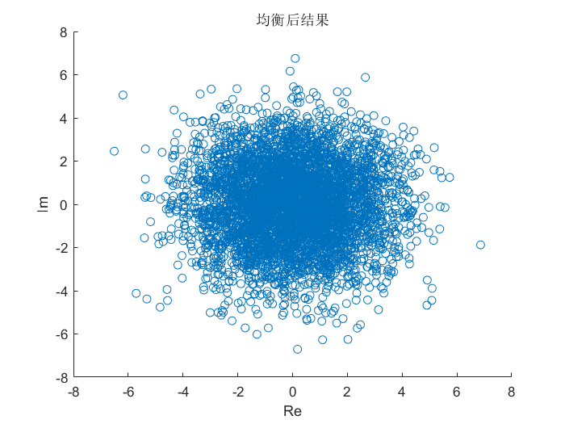

`SER=0.9216`

#### 步长=0.001,迭代次数=300

输出均衡器散点图如下：

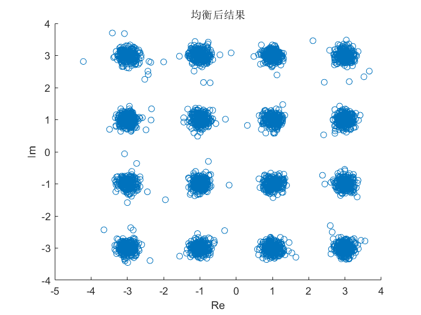

`SER=0.0004`

#### 步长=0.001，迭代次数=500

输出均衡器散点图如下：

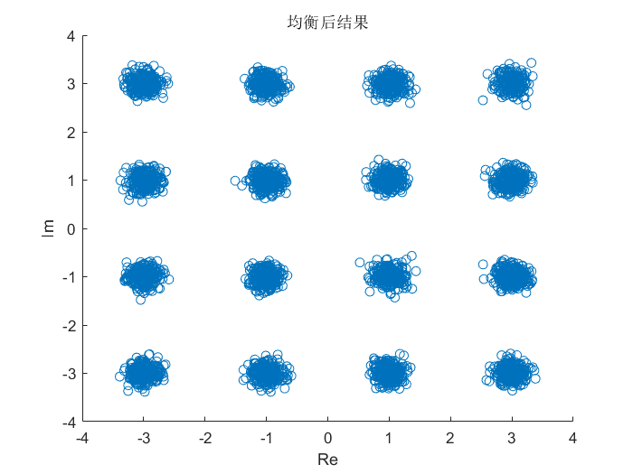

`SER=0`

综合上面各项参数调整后的图可以看出，在迭代次数一定的情况下，较大的迭代步长会显著降低错误率，同时，若可以容忍一定的错误率，则采取较大的迭代步长可以快速的收敛到合适的均衡器参数。同时，选择不同的自适应均衡算法也有会较大的区别，在一开始时，$\mu=0.001$，我并没有注意到采用LMS算法，而是默认采用了$\varepsilon-NLMS$算法，发现错误率极高（如下图）

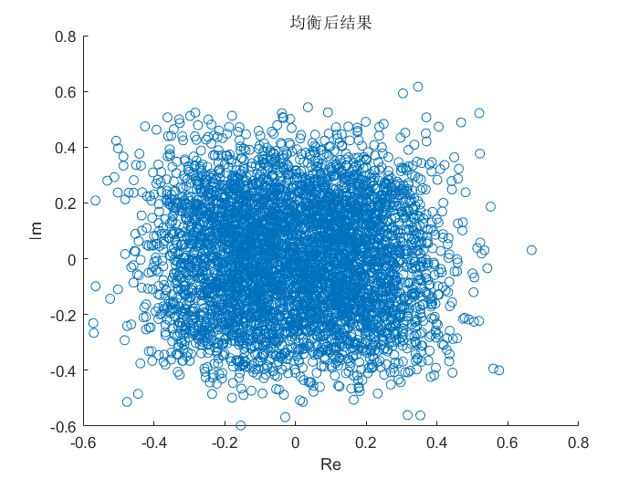

`SER=0.9936`，这意味着两种算法的最优步长并不相同。分析两种算法的原理：

$LMS$更新过程
$$
c=c+\mu e_kx_{k\_n}
$$
$\varepsilon-NLMS$
$$
c=c+\frac{\mu e_x x_{k\_n}}{\varepsilon+\sum_{i=-N}^{N}|x_{k+i}|^2}
$$
即后者相较于前者多出了一个${\varepsilon+\sum_{i=-N}^{N}|x_{k+i}|^2}$，从而使得两者的迭代步长不同。

## `256-QAM`均衡器输出散点图

将输入信号改为`256-QAM`，均衡器输出散点图如下：

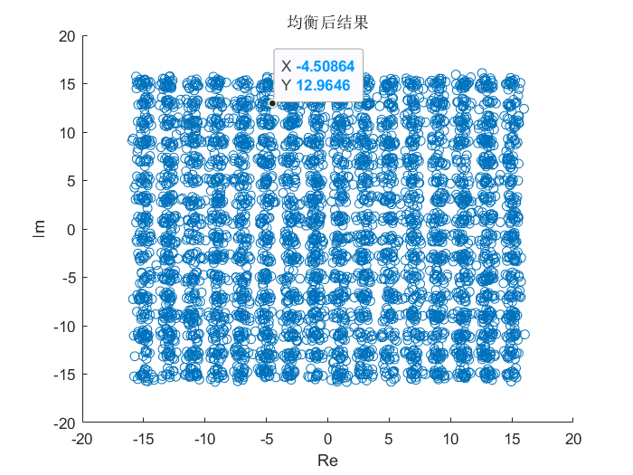

此时`SER=0.0074`,观察上图可知，$\varepsilon-NLMS$达到了较好的均衡效果，但由于采用了`256-QAM`，星座图中各点之间距离较近，码间串扰较大，$\varepsilon-NLMS$不能完全消除码间串扰，但是相较于非均衡措施（下图）有了即为显著的改进，大致可以分清各个点所属的星座点。

未经过均衡散点图：

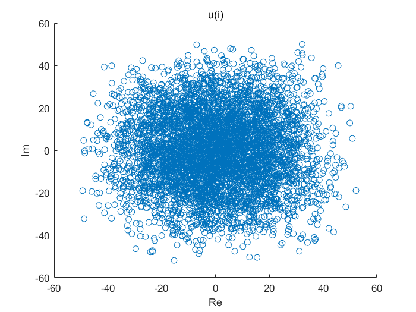

## $\varepsilon-NLMS$算法对应的`SER-SNR`曲线

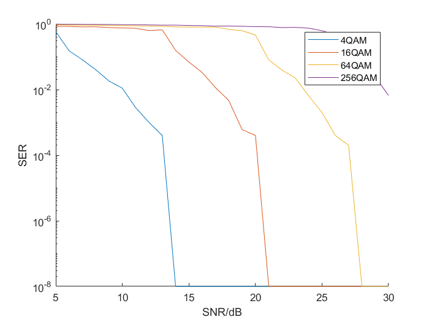

调制方式与`SNR`均会影响`SER`，保持调制方式不变，`SNR`越高，则误符号率越低，且此时`SNR`似乎还存在一个阈值，即高于该阈值时，极小的`SNR`增加就会导致`SER`的大幅度下；保持`SNR`不变，调制星座图越简单（点数越少），则误符号率越低。该曲线下围成的面积越小，则系统性能越好（低SNR，低SER）